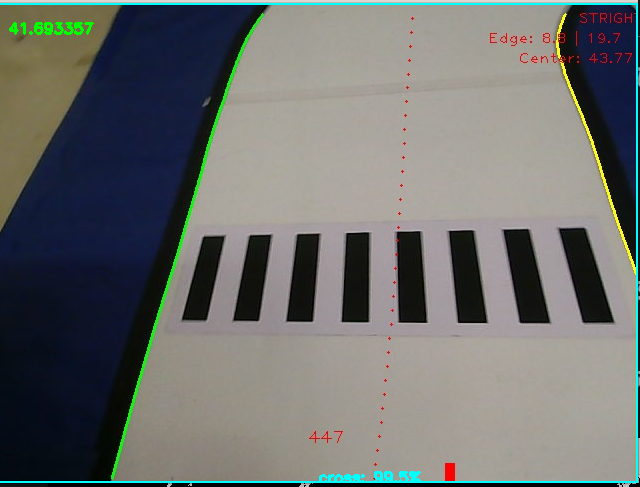

# **iCar_Detector**

## Overview

完全模型组传统视觉高帧率分类器

此项目为[rm_auto_aim](https://github.com/DJTU-RM-TOE/rm_auto_aim)的fork项目，在此感谢君的开源

## icar_detector

### 锥桶

|  |  |  |
| :----------------------------------------------------------: | :----------------------------------------------------------: | :----------------------------------------------------------: |
|                             原图                             |                        通过颜色二值化                        |                           特征判断                           |

首先通过inRange筛选HSV图像， 然后根据锥桶的轮廓外接矩形长宽比和矩形内白色占比进行特征判断

### 爆炸物和路牌

|  |  |  |
| :----------------------------------------------------------: | :----------------------------------------------------------: | :----------------------------------------------------------: |
|                             原图                             |                        通过颜色二值化                        |                             mlp                              |

首先通过inRange筛选HSV图像， 经过轮廓外接矩形长宽比特征判断后，交给mlp神经网络进行分类任务

### 斑马线和障碍块

|  |  |  |  |
| :----------------------------------------------------------: | :----------------------------------------------------------: | :----------------------------------------------------------: | :----------------------------------------------------------: |
|                             原图                             |                        通过颜色二值化                        |                             mlp                              |                           特征判断                           |

首先通过inRange筛选HSV图像， 然后交给mlp进行分类，最后对矩形内白色占比进行特征判断
